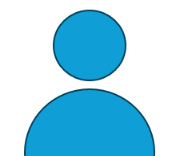

<header>
    <h1><a href="index.html">鷹取研究室</a></h1>
    
Wireless Communications & ISAC Laboratory

</header>

<nav>
    <a href="index.html">Home</a>
    <a href="research.html">研究紹介</a>
    <a href="members.html" class="active">メンバー</a>
    <a href="equipment.html">研究設備</a>
    <a href="publications.html">研究実績</a>
    <a href="topics.html">Topics</a>
    <a href="contact.html">Information</a>
</nav>

<!-- 修士1年 -->

<h2>修士1年</h2>

<h3>名前 さん</h3>

<b>趣味:</b> ドラム

<b>一言:</b> サボテン育成中！

<!-- 大学4年 -->

<h2>大学4年</h2>

<h3>名前 さん</h3>

<b>趣味:</b> ○○

<b>一言:</b> ○○

        

<h3>名前 さん</h3>

<b>趣味:</b> ○○

<b>一言:</b> ○○

<!-- 大学3年 -->

<h2>大学3年</h2>

<h3>名前 さん</h3>

<b>趣味:</b> ○○

<b>一言:</b> ○○

        

<h3>名前 さん</h3>

<b>趣味:</b> ○○

<b>一言:</b> ○○

<footer>&copy; 2026 Takatori Laboratory</footer>